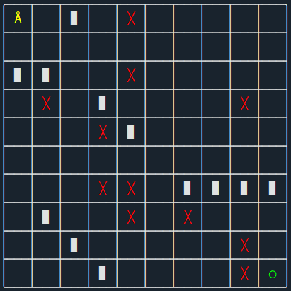
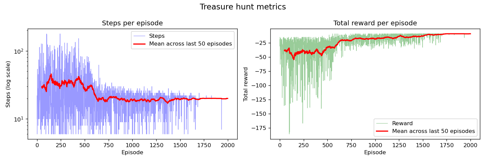
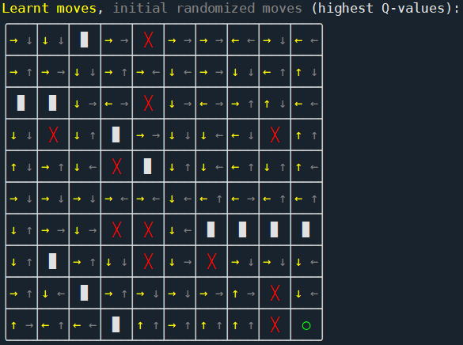

# Treasure hunt (Q-learning from scratch)

A custom reinforcement learning program in which an agent learns, through trial and error, to navigate a 10-by-10 grid from top-left to bottom-right, while avoiding traps and walls. This program was made in an effort to understand details of reinforcement learning better, and ended up a valuable lession in how Q-learning works. This is inspired by the simple maze example presented in [this article by Neha Desaraju](https://towardsdatascience.com/hands-on-introduction-to-reinforcement-learning-in-python-da07f7aaca88).

When I first attempted to approach the game with a G-table (one value per tile), the agent kept converging on trap tiles because correct-path tiles accumulated more negative value from timeout episodes. Switching to a Q-table per `(tile, action)` pair fixed it.

To run it, type this in your console:

```
pip install numpy matplotlib
python treasure_hunt_RL.py
```

---

## The board

The initialized board looks as follows:



| Symbol | Meaning |
|---|---|
| **Å** (yellow) | Agent, starts top-left |
| **╳** (red) | Trap, ends episode, -10 reward |
| **◯** (green) | Treasure, goal, +10 reward |
| **▉** | Wall, impassable |
| (empty) | Safe tile, -1 per step |

The -1 step cost pushes the agent toward short paths rather than just any path.

---

## How it learns

The agent keeps a **Q-table** mapping every `(position, action)` pair to a value representing how rewarding it is to take that action from that tile. After each step it updates using the Bellman equation:

```
Q(s,a) = Q(s,a) + alpha * (target - Q(s,a))

target = reward                          (terminal step)
       = reward + gamma * max Q(s', a')     (otherwise)
```

At each step it either explores (random action) or exploits (best Q-value). The exploration rate starts at 35% and shrinks for each episode. Updates happen after every step rather than at episode end, so signals from the goal propagate back through the table quickly.

| Parameter | Value | Effect |
|---|---|---|
| `alpha` | 0.12 | Learning rate |
| `gamma` | 0.95 | How much future rewards count |
| `exploration_rate` | 0.35 | Starting probability of random moves |
| `exploration_reduction` | 2e-4 | Decay in probability of random moves per episode |
| `NUM_EPISODES` | 2000 | Training episodes |

---

## Output



Steps per episode (log scale) should trend down; total reward per episode should trend up toward -10 as the agent finds shorter, trap-free routes.

After training the script also prints the learnt best move per tile alongside the initial random moves, so you can see directly how the policy changed.

The learnt moves look as follows:



From this you can glean that after only 2000 episodes, the algorithm has found three main paths from the start (top-left tile) to the end (bottom-right tile) that maximize the reward. It is also nearly always able to recover when it strays away from these paths. Nevertheless, with the given configuration, some pockets of the board normally lead to unrecoverable paths. This can be mitigated by changing configurations, such as increasing the number of episodes.
